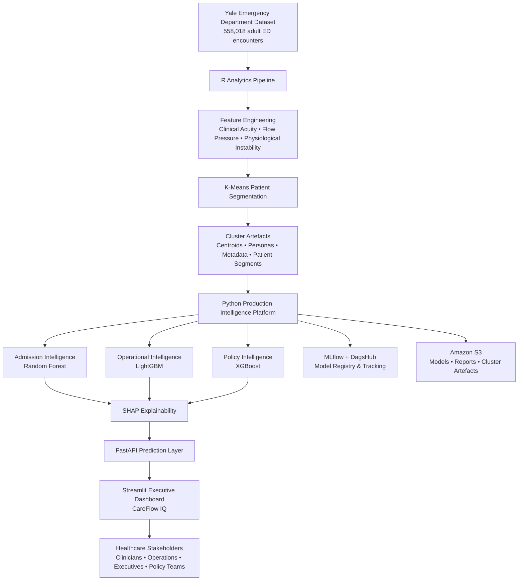

# CareFlow IQ Architecture

## 1. End-to-End System Architecture

```mermaid
flowchart TD
    A[Yale Emergency Department Dataset<br/>558,018 adult ED encounters] --> B[R Analytics Pipeline]
    B --> C[Feature Engineering<br/>Clinical Acuity • Flow Pressure • Physiological Instability]
    C --> D[K-Means Patient Segmentation]
    D --> E[Cluster Artefacts<br/>Centroids • Personas • Metadata • Patient Segments]

    E --> F[Python Production Intelligence Platform]
    F --> G1[Admission Intelligence<br/>Random Forest]
    F --> G2[Operational Intelligence<br/>LightGBM]
    F --> G3[Policy Intelligence<br/>XGBoost]

    G1 --> H[SHAP Explainability]
    G2 --> H
    G3 --> H

    H --> I[FastAPI Prediction Layer]
    I --> J[Streamlit Executive Dashboard<br/>CareFlow IQ]

    J --> K[Healthcare Stakeholders<br/>Clinicians • Operations • Executives • Policy Teams]

    F --> L[MLflow + DagsHub<br/>Model Registry & Tracking]
    F --> M[Amazon S3<br/>Models • Reports • Cluster Artefacts]
```