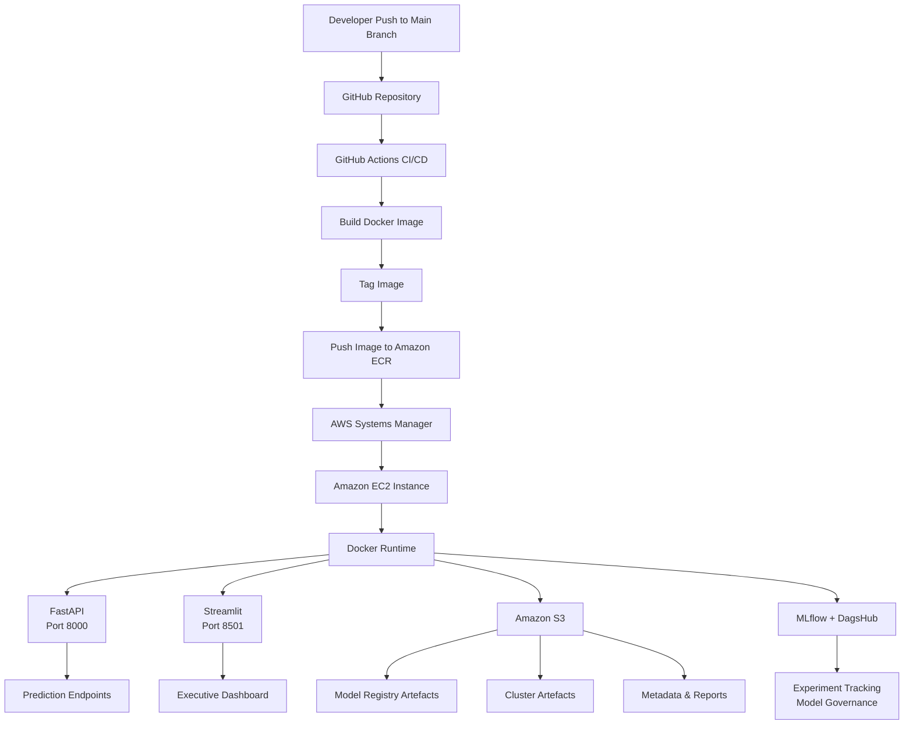

# Cloud Deployment Architecture



## Deployment Flow

```text
GitHub Push
   ↓
GitHub Actions
   ↓
Docker Build
   ↓
Amazon ECR
   ↓
AWS SSM
   ↓
EC2 Docker Container
   ↓
FastAPI + Streamlit
   ↓
CareFlow IQ Live Platform
```