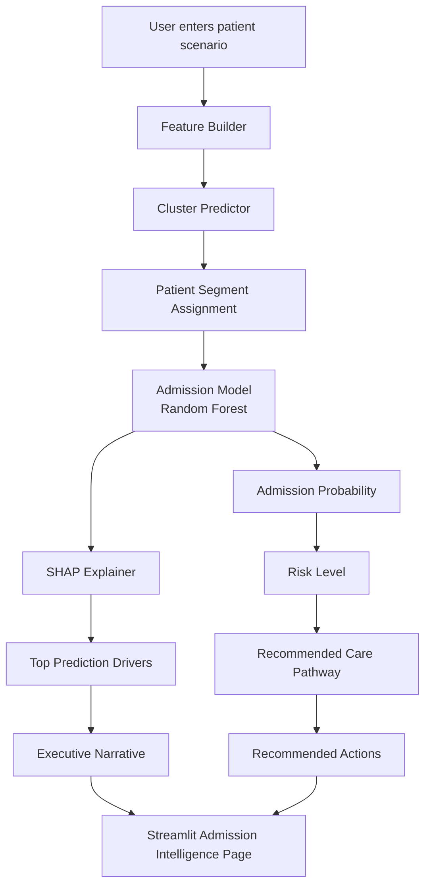

# Prediction Workflow

## Output Generated

The Admission Intelligence module produces:

- Admission probability
- Risk level
- Patient segment
- Segment confidence
- Recommended care pathway
- SHAP-based prediction drivers
- Executive narrative
- Recommended operational actions