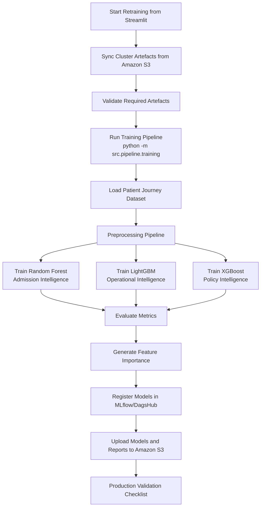

# Model Retraining Workflow

## Governance Value

The retraining workflow supports reproducibility, auditability and controlled model lifecycle management. It ensures that refreshed models are validated, tracked and stored before being used in production decision support.